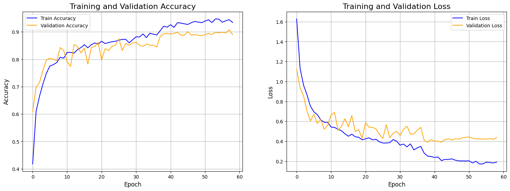
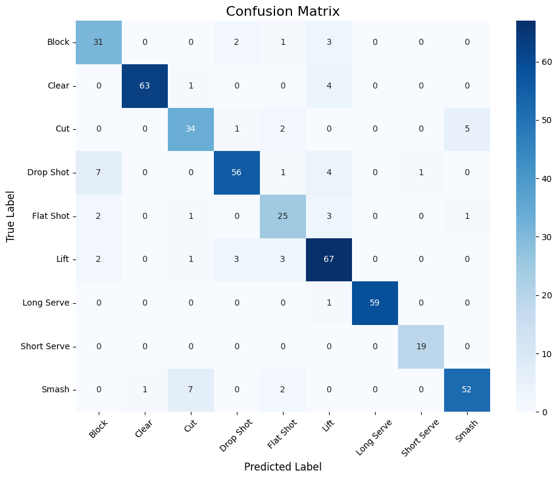

# Badminton Technique Recognition (Nhận dạng kỹ thuật cầu lông)

Dự án này xây dựng một mô hình Deep Learning để nhận dạng các kỹ thuật đánh cầu lông (ví dụ: smash, clear, drop) từ video. Mô hình sử dụng kết hợp mạng Convolutional Neural Network (CNN) và Long Short-Term Memory (LSTM) hai chiều với cơ chế Attention để phân loại chuỗi hành động.

## Kiến trúc mô hình

Mô hình xử lý chuỗi dữ liệu đa chiều bao gồm:

1.  **Đặc trưng hình dáng:** Tọa độ tương đối của các khớp xương (keypoints) của người chơi so với vị trí trung tâm hông.
2.  **Đặc trưng chuyển động:** Vận tốc của các khớp xương và của quả cầu qua các frame liên tiếp.

Dữ liệu đặc trưng này sau đó được đưa qua:
* **Lớp Conv1D:** Để trích xuất các đặc trưng không gian-thời gian cục bộ.
* **Lớp Bi-directional LSTM:** Để học các phụ thuộc dài hạn trong chuỗi hành động.
* **Lớp Attention:** Để tập trung vào những frame quan trọng nhất trong một hành động.
* **Lớp Classifier (Fully Connected):** Để đưa ra dự đoán cuối cùng.

## Cấu trúc dự án

```
Badminton_Action_Recognition/
├── data/
│   ├── raw_videos/
│   ├── processed_frames/
│   └── features_csv/
├── src/
│   ├── extract_frames.py
│   ├── extract_keypoints.py
│   ├── extract_ball_coords.py
│   ├── config.py
│   ├── model.py
│   ├── utils.py
│   └── train.py
├── requirements.txt
└── README.md
```

## Hướng dẫn cài đặt và sử dụng

### Yêu cầu
* Python 3.8+
* Git

### 1. Cài đặt môi trường

**a. Clone repository này:**
```bash
git clone [https://github.com/your-username/Badminton-Action-Recognition.git](https://github.com/your-username/Badminton-Action-Recognition.git)
cd Badminton-Action-Recognition
```

**b. Clone repository TrackNetV3 (dùng để theo dõi quả cầu):**
Dự án này yêu cầu [TrackNetV3](https://github.com/qaz812345/TrackNetV3). Clone nó vào thư mục gốc của dự án.
```bash
git clone [https://github.com/qaz812345/TrackNetV3.git](https://github.com/qaz812345/TrackNetV3.git)
```

**c. Tạo môi trường ảo và cài đặt thư viện:**
```bash
# Tạo môi trường ảo
python -m venv venv

# Kích hoạt môi trường (Windows)
.\venv\Scripts\activate
# Kích hoạt môi trường (macOS/Linux)
# source venv/bin/activate

# Cài đặt các thư viện cần thiết
pip install -r requirements.txt

# Cài đặt thư viện cho TrackNetV3
pip install -r TrackNetV3/requirements.txt
```

**d. Tải các trọng số cần thiết:**
* **rtmlib:** Các mô hình của `rtmlib` sẽ tự động được tải về trong lần chạy đầu tiên.
* **TrackNetV3:** Tải các file `TrackNet_best.pt` và `InpaintNet_best.pt` từ trang của TrackNetV3 và đặt chúng vào thư mục `TrackNetV3/`.

### 2. Chuẩn bị dữ liệu
Đặt các video huấn luyện của bạn vào thư mục `data/raw_videos/`. Mỗi kỹ thuật (lớp) nên có một thư mục riêng.
Ví dụ:
```
data/raw_videos/
├── smash/
│   ├── video1.mp4
│   └── video2.mp4
├── clear/
│   └── video3.mp4
```

### 3. Quy trình thực thi
Chạy các script trong thư mục `src/` theo đúng thứ tự. Mở terminal tại thư mục gốc của dự án (`Badminton-Action-Recognition/`).

**Bước 1: Trích xuất Frames từ Video**
```bash
python src/extract_frames.py
```
* **Đầu vào:** `data/raw_videos/`
* **Đầu ra:** `data/processed_frames/`

**Bước 2: Trích xuất Keypoints người chơi**
```bash
python src/extract_keypoints.py
```
* **Đầu vào:** `data/processed_frames/`
* **Đầu ra:** Các file `*_keypoints.csv` trong `data/features_csv/`

**Bước 3: Trích xuất tọa độ quả cầu**
```bash
python src/extract_ball_coords.py
```
* **Đầu vào:** `data/raw_videos/`
* **Đầu ra:** Các file `*_ball.csv` trong `data/features_csv/`

**Bước 4: Huấn luyện mô hình**
Sau khi tất cả các file đặc trưng đã được tạo, bắt đầu huấn luyện:
```bash
python src/train.py
```
* **Đầu vào:** `data/features_csv/`
* **Đầu ra:**
    * File model tốt nhất `badminton_action_classifier.pth` ở thư mục gốc.
    * Đồ thị `training_history.png`.
    * Ma trận nhầm lẫn `confusion_matrix.png`.
    * Kết quả đánh giá trên console.

### 4. Tùy chỉnh
Bạn có thể dễ dàng thay đổi các tham số như learning rate, số epochs, kích thước batch, và các đường dẫn thư mục bằng cách chỉnh sửa file `src/config.py`.

## Kết quả

### Đồ thị quá trình huấn luyện

Đồ thị bên trái biểu diễn độ chính xác (Accuracy), đồ thị bên phải biểu diễn hàm mất mát (Loss) trên tập huấn luyện và tập kiểm định qua các epochs.



### Ma trận nhầm lẫn (Confusion Matrix)

Ma trận nhầm lẫn cho thấy hiệu suất của mô hình trên từng lớp của tập dữ liệu test.

